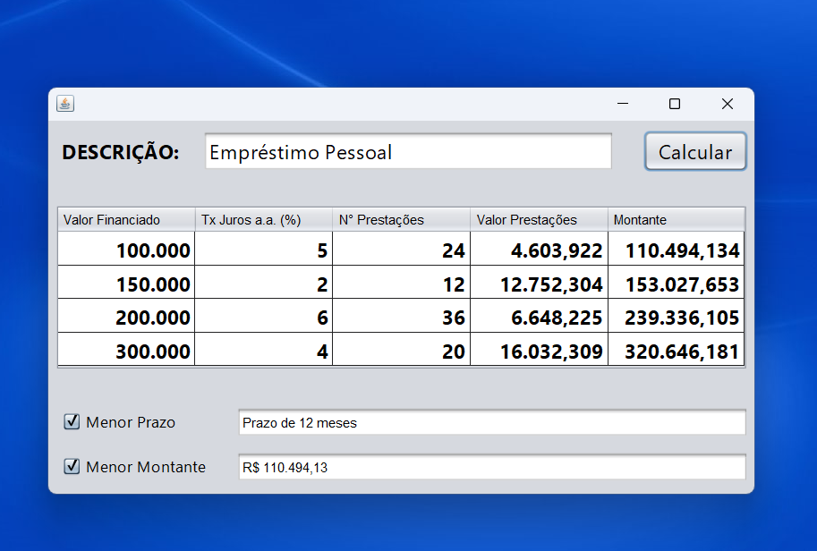

<h1 align="center">Calculadora Financiamento Java</h1>
<h1 align="center"></h1>

### 📚  Sobre
Projeto Java - Calculadora desenvolvida para fixação de conteúdo do curso PROGRAMADOR JAVA BÁSICO (+IFMG).

### 🎨  Detalhe
Para desenvolver a Calculadora de Financiamento, foi utilizado o componente JFrame para criar interface gráfica em Java.

---

Feito com ♥ by Lu Silva :wave:

---
<h1> Contato </h1> 

  

